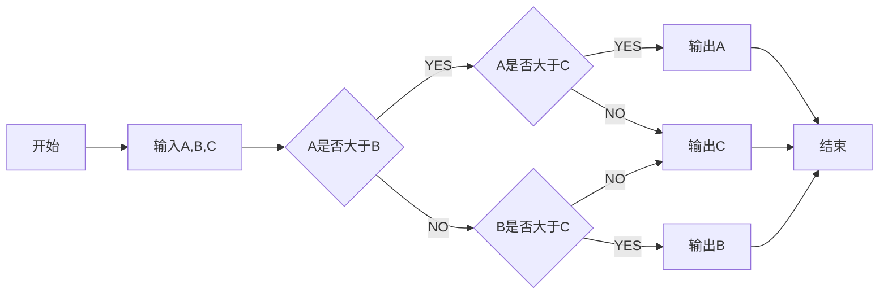

# CODING

## A sample program

    ```
        using System; 
        using System.Collections.Generic; 
        using System.Linq; 
        using System.Text; 
        using System.Threading.Task; 

        namesspace SimpleCSharpApp {
            // option one. 
            class Program {
                static void Main() {    // 这里的签名也可以写作: static void int Main(string[] args)
                    Console.WriteLine("**** Hello CSharp! ****"); 
                    Console.ReadLine(); 
                }
            }

            // option two.
            class Program {
                static int Main(string[] args) {
                    foreach(string arg in args) {
                        Console.WriteLine("Arg: {0}", arg)
                    }
                    return 0; 
                }
            }
        }
    ```

    - Main： app入口。必须给工程指定，可以通过命令行编译器的/main选项。



