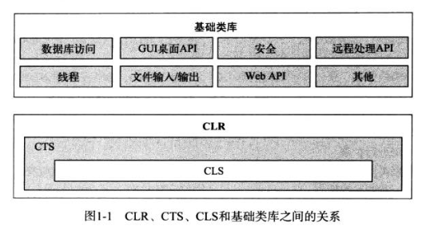
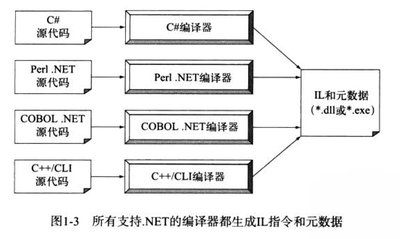
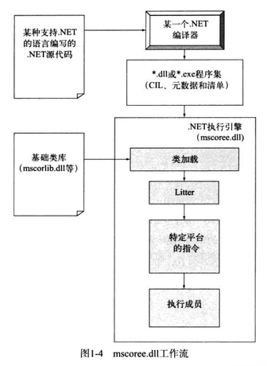

# C\# 

<!-- MarkdownTOC auotlink="true"  -->

- What is .Net
- C\
    - 优点
    - 托管
- .NET 程序集概览

<!-- /MarkdownTOC -->


## What is .Net

.NET 可以理解为一个运行库环境和一个全面的基础类库, 包括: 

- 公共语言运行库 (CLR, Common Language Runtime)
    + 定位加载和管理 .NET 
    + 同时，负责内存管理、应用托管、处理线程、安全检查等（Like JVM）
- 公共类型系统 （CTS, Common Type System）
    + CTS 规范完整地描述了运行库所支持的所有可能的**数据类型**和**编程结构**
    + 并指定实体之间如何交互
- 公共语言规范 （CLS， Common Language Specification）
    + 定义了一个让所有.NET语言都支持的公共类型和编程结构的子集。
- 基础类库 （BCL）
    + 这个基础类库不仅封装了各种基本类型，如线程、文件输入\输出。
    + 使用 ASP.NET 创建 Web 站点。 
    + 使用 WCF 创建网络服务。 
    + 使用 WPF 创建桌面 GUI 程序。
    
 <div align="center">
    </div>

## C\# 

### 优点 
- 不需要指针。但也可以自由进行底层操作
- 垃圾收集能够自动管理内存
- 类、接口、结构、枚举和委托都有正式的语法结构
- 具有C++类似的功能，例如重载操作符为自定义类型
- 支持基于特性的编程
- others

### 托管

C/#d生成的代码只能在.NET运行库中执行（不能使用C/#来构建本机的COM服务或非托管的C//C++ API应用程序）。不能直接在.NET运行库中承载的代码称为非托管代码。

## .NET 程序集概览

大部分还是使用自己习惯的.NET语言来编写程序。

.NET 二进制文件与非托管Windows二进制文件（*.dll 或 .exe）具有相同的文件扩展名，但是它们的内部却是完全不相同的。.NET二进制文件不包含特定于平台的指令，它包含的是平台无关的IL（Intermediate Language, 中间语言）和类型元数据。如下图所示：

 <div align="center">
</div>

```
using System 

namespace CalculatorExample {

    class Program {
        static void Main() {
            Calc c = new Calc() ;
            int ans = c.Add(10, 84); 
            Console.WriteLine("10 + 84 is {0}", ans); 

            Console.ReadLine(); 
        }
    }

    class Calc {
        public int Add(int x, int y) {
            return x + y; 
        }
    }
}
```
 
C/# 编译器（csc.exe）编译这段代码后，就会得到一个单文件*.exe程序集，包含： 

+ 一个程序清单（manifest）
+ CIL指令
+ 描述Calc与Program类的各方面信息的元数据.  

发生在源代码（使用了许多基础类库类型）、.NET编译器和.NET执行引擎之间的工作流

 <div align="center">
</div>

### 程序集
mscorlib.dll 包含了许多不同的命名空间（如System.io）。许多核心的.NET命名空间包含在 mscorlib.dll 文件中，例如System.IO等等。但System.Drawing.Bitmap类型班汉在一个名为System.Drawing.dll程序集中。大多数.NET Framework程序集都位于称为全局程序集缓存（Global Assembly Cache）的特定目录下。 


## 构建 C# 程序

假设有如下两个文件：

- HelloMsg.cs文件 

```
        using System; 
        using System.Windows.Forms;
        class HelloMessage {
            public void speak() {
                MessageBox.show("Hello world"); 
            }
        }
```

 
- TestApp.cs 

```
     class TestApp {
        static void Main() {
            Console.WriteLine("Testing! 1, 2, 3"); 

            HelloMessaged h = new HelloMessage(); 
            h.speak(); 
        }
     }
```

构建方式有如下几种：

- 第一种： 
    + 使用命令： csc /r:System.Windows.Forms.dll TestApp.cs HelloMsg.cs
        * /r: 表示程序中由using加载的（由；分割），而命令后面是程序集包含了cs代码（由空格分割）
- 第二种：
    + 使用响应文件，编写扩展名为rsp的响应文件。例如：TestApp.rsp
        ```
        /r: System.Windows.Forms.dll
        /target:exe /out:TestApp.exe *.cs
        ```
    + 之后通过命令加载：csc @TestApp.rsp